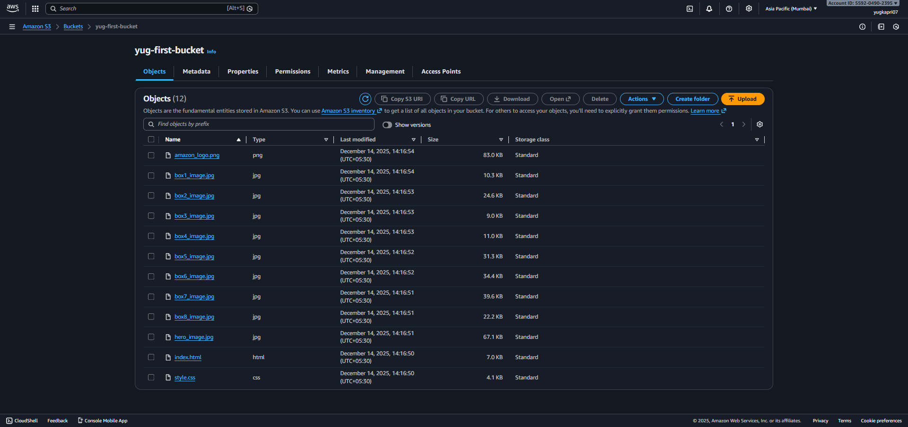

# 🛒 Amazon Clone (AWS S3 Hosted)

An **Amazon Clone** web application that replicates the basic UI and shopping experience of Amazon.  
This project is hosted using **AWS S3 Static Website Hosting**, showcasing frontend skills and cloud deployment knowledge.

---

## 📌 Project Overview

This project is a static web application inspired by Amazon’s homepage.  
It focuses on building a responsive UI and deploying it using AWS cloud services.

---

## 🚀 Tech Stack

### Frontend
- HTML5  
- CSS3  
- JavaScript  

### Cloud / DevOps
- **AWS S3** – Static website hosting  
- **AWS IAM** – Access management  
- **S3 Bucket Policy** – Public read access  

---

## 🏗️ Architecture

- User accesses the website via a public URL  
- Requests are served directly from **Amazon S3**  
- S3 bucket is configured for **static website hosting**

---

## ☁️ AWS Console Deployment Screenshot

Below is a screenshot from the AWS Console showing the **S3 static website hosting configuration** used to deploy this project:

---

## 🛠️ How to Deploy on AWS S3 (Static Website)

1. Create an **S3 bucket** with a unique name  
2. Upload all project files (`index.html`, CSS, JS, assets)  
3. Enable **Static Website Hosting**  
4. Set `index.html` as the index document  
5. Update the **Bucket Policy** to allow public read access  
6. Access the site using the **S3 website endpoint**

---

## 📚 Learning Outcomes

- AWS S3 static website hosting

- Cloud deployment basics

- Bucket policies and public access

- Frontend project structuring

- GitHub documentation best practices

